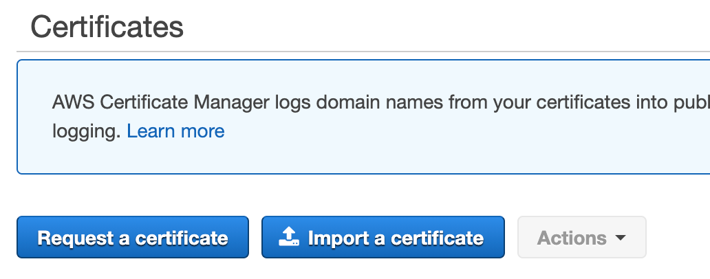

# EKS cluster with ArgoCD 

This project is used to deploy AWS EKS cluster from scratch with ArgoCD.  
Once the cluster and ArgoCD are up and running, ArgoCD deploys applications, 
defined in the https://github.com/chiplduk/kubernetes-stuff.git repository

## Prerequisites
This approach is tested on Ubuntu 22.04.3 LTS on Windows WSL2.  
You need to have AWS account with S3 bucket deployed to store terrafrom state files.

### 1. Install Docker and Act (local runner for GitHub actions)

* Docker: https://docs.docker.com/engine/install/ubuntu/ 
* Act: https://github.com/nektos/act

### 2. Generate self-signed certificate and upload to ACM
#### a. Generate a private key using the following command.

`$ openssl genrsa -out ./server.key 2048`

#### b. Generate a public key with the following command. I set “*.svc.cluster.aws” as “Common Name”.

`$ openssl req -new -key ./server.key -out ./server.csr`
```
Country Name (2 letter code) []:JP
State or Province Name (full name) []:Tokyo
Locality Name (eg, city) []:Unknown
Organization Name (eg, company) []:zuqqhi2
Organizational Unit Name (eg, section) []:
Common Name (eg, fully qualified host name) []:*.svc.cluster.aws
Email Address []:
…
A challenge password []:
```
#### c. Create Self-Signed Certificate using the following command with the private/public key.

```$ openssl x509 -in ./server.csr -days 365 -req -signkey ./server.key -out ./server.crt```

#### d. Applying Self-Signed Certificate to AWS ALB

Click “Import a certificate” button on ACM console.


Copy contents of server.crt to “Certificate body” and contents of server.key to “Certificate private key”. Keep “Certificate chain” empty and click “Next” button. (the following screen shot shows error but ignore)


Click “Review and import” button at next screen, and then please click “import” button.

### 3. Create file with AWS credentials

```
cat << EOF > .env
AWS_ACCESS_KEY_ID=XXXXXXXXXXXXXXXXX
AWS_SECRET_ACCESS_KEY=XXXXXXXXXXXXXXXX
AWS_DEFAULT_REGION=<region>
TFSTATE_BUCKET=<bucket_name>
TFSTATE_REGION=<bucket_region>
EOF
```  

## 4. Deploy EKS and applications using Act

```act -j eks-deploy --env-file .env```

## 5. Configure access to the applications

After job finishes sucessfully you will get an output with ALB Listener Public IPs
```
Outputs:

alb_public_ips = [
  "52.48.166.10",
  "52.16.192.184",
  "34.246.130.128",
]
```
You need to update `/etc/hosts` (or `C:\Windows\System32\drivers\etc\hosts` in case of Windows WSL2) file to have an access to services in cluster through ALB (1 ALB public IP is enough)
```
52.48.166.10  argocd.svc.cluster.aws
52.48.166.10  ks.svc.cluster.aws
52.48.166.10  hello.svc.cluster.aws
```

Now you can reach out application over browser

* https://argocd.svc.cluster.aws/
* https://ks.svc.cluster.aws/
* https://hello.svc.cluster.aws/

## Get ArgoCD password
`aws eks update-kubeconfig --region eu-west-1 --name main`  
`kubectl -n argocd get secret argocd-initial-admin-secret -o jsonpath="{.data.password}" | base64 -d`

## Destroy EKS and applications using Act

```act -j eks-destroy --env-file .env```